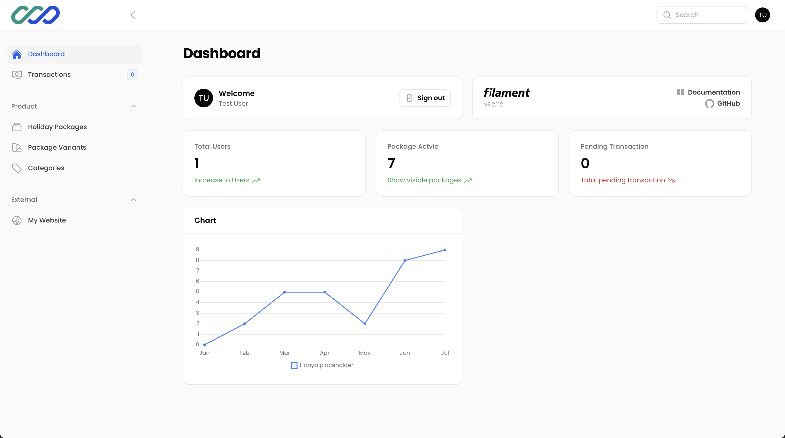

<div align="center">


</div>

# TravelKuy Admin Dashboard

TravelKuy Admin Dashboard is a powerful administrative interface built with Laravel and Filament. It provides comprehensive management capabilities for a travel booking system, allowing administrators to efficiently handle transactions, user accounts, holiday packages, and categories.

## Features

- **User Management**: Create, view, update, and delete user accounts.
- **Transaction Handling**: Manage and track all travel bookings and transactions.
- **Holiday Package Management**: Add/Edit poster image, Create, and manage holiday packages offered to customers.
- **Category Organization**: Organize holiday packages into categories for easy navigation.
- **Dashboard Analytics**: View key metrics and statistics about bookings and user activity.

## Entity-Relationship Diagram (ERD)

To understand the data structure of TravelKuy, please refer to our Entity-Relationship Diagram:


This diagram illustrates the relationships between Users, Transactions, Holiday Packages, and Categories.

## Installation

1. Clone the repository:
   ```
   git clone https://github.com/asiata25/travel-kuy.git
   ```

2. Navigate to the project directory:
   ```
   cd travel-kuy
   ```

3. Install PHP dependencies:
   ```
   composer install
   ```

4. Install JavaScript dependencies:
   ```
   npm install
   ```

5. Copy the `.env.example` file to `.env` and configure your database settings.

6. Generate an application key:
   ```
   php artisan key:generate
   ```

7. Run database migrations:
   ```
   php artisan migrate
   ```

8. Seed the database with initial data (optional):
   ```
   php artisan db:seed
   ```

9. Create a symbolic link for storage:
   ```
   php artisan storage:link
   ```

   **Don't forget this step!** It's crucial for proper file handling in the application.

## Running the Application

1. Start the Laravel development server:
   ```
   php artisan serve
   ```

2. In a new terminal, compile and watch for asset changes:
   ```
   npm run dev
   ```

3. Open `http://localhost:8000/dashboard`
   

## Test Account

For testing purposes, you can use the following credentials to access the admin dashboard:

- Email: test@example.com
- Password: password


## Author

<p align="center">
<a href="https://lutfikhoir.com/"></a>
<a href="https://www.linkedin.com/in/lutfi-khoir-632524235/"></a>
<a href="https://www.instagram.com/lutfi.khoirudin/"></a>
<a href="https://www.youtube.com/@lutfikhoir2502"></a>

</p>
